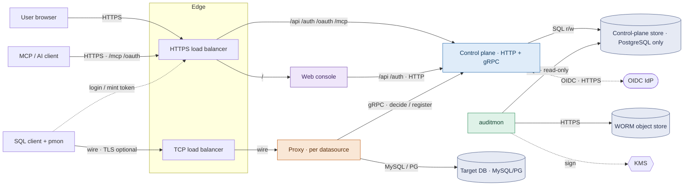

# Architecture

The canonical description of what the parts of proxy-monster are, how they talk,
and where the trust boundaries sit. [DESIGN.md](./DESIGN.md) covers the design
decisions on top of this shape — goals, the enforcement decision flow, identity,
JIT elevation, risks. [INSTALL.md](./INSTALL.md) covers running and deploying
it.

## Topology

Two front doors face users: the web console over HTTPS, and the proxy over the
native SQL wire (reached through pmon). Everything else belongs on an internal
network — in particular the proxy-to-control-plane gRPC channel, which the
control plane binds on every interface in plaintext HTTP/2 and does not itself
restrict, so keeping it off a public listener is your job. The diagram shows an
AWS edge because that is the reference deployment; the component shape is the
same anywhere.

## Components

Five long-running server components, plus pmon, the client-side connector users
run to reach the proxy.

Two of these are databases, and they are not interchangeable. A **target
database** is what the proxy protects — MySQL or PostgreSQL, one per datasource.
The **control-plane store** is what proxy-monster itself runs on — PostgreSQL
only.

<!-- prettier-ignore -->
| Component | Kind | Role |
| --- | --- | --- |
| Proxy | data plane · Go | Terminates SQL wire connections in front of one target database (MySQL or PostgreSQL). Authenticates the client to a principal (a minted token as the wire password), asks the control plane to authorize each statement, applies masking, relays to the backend. Introspects the backend catalog and pushes it up. Fails closed. One proxy per datasource. |
| Control plane (CP) | brain · Kotlin/Ktor | Owns identity (OIDC login, sessions, roles and groups), policy (Cedar), the catalog, and the per-statement decision. Exposes HTTP (web API, auth and OIDC, an OAuth 2.1 server + MCP resource) and gRPC (proxies register and fetch decisions). Persists to its own PostgreSQL store; never touches a target database directly. |
| Web console | UI · Next.js | User-facing UI: query editor, policy/role/grant management, approvals, audit view. Thin, and holds no state. Rewrites `/api` and `/auth` to the CP so the browser talks same-origin — the browser's paths, not the CP's whole surface: `/mcp`, `/oauth`, and `/.well-known` are not rewritten, so a deployment using MCP routes those to the CP at the edge (see [How users reach it](#how-users-reach-it)). |
| auditmon | watcher · Go | Independent audit monitor: reads the committed trail, re-verifies the tamper-evident hash chain, exports redacted batches to a WORM object store, signs off-box anchors, runs anomaly rules to alerts. Separate from the CP by design. Its access to the control-plane store is read-only. |
| Control-plane store | store · PostgreSQL only | System of record: identity, policy, catalog, sessions, and the `audit_event` hash chain. The CP reads and writes it; auditmon only reads. PostgreSQL is the only supported store engine — `Db.kt` hardcodes the Postgres JDBC driver, and the migrations use `RETURNING`, `ON CONFLICT`, `jsonb`, and `::` casts. Independent of which engine a target database runs. |
| pmon | client connector · Go | A single static binary each user runs locally. `pmon login` authenticates to the CP (OIDC device auth) and mints a short-lived wire token, and re-running it is how a login is extended — there is no silent renewal in the client; the daemon then opens one local broker per datasource, which any SQL client points at with the sticky local password, injecting the real token upstream and pinning the proxy to its advertised leaf-cert fingerprint. |

Source layout, module by module, is in [AGENTS.md](./AGENTS.md#layout).

## Where enforcement happens

A statement crosses the plane boundary exactly once, and the split is the point:
the data plane can relay and mask but cannot decide, and the control plane can
decide but never opens a connection to a target database.

1. The proxy (`goproxy/`) accepts the native MySQL/PG connection, handles the
   optional TLS handshake and the token auth-switch, and decodes protocol
   messages. It holds no policy.
2. The control plane validates the token to a principal and resolves roles
   server-side — `principal_role`, group-derived, plus active JIT grants — never
   trusting a client-asserted role.
3. The analyzer (`analyzer/`, sqlglot-go reached from the JVM through a Foreign
   Function & Memory binding) parses the statement, resolves column lineage
   against the per-connection catalog, and emits the `StatementFacts` /
   `RequiredGrant` contract: every table, column, function, and utility the
   statement needs, each with its mask disposition. No SQL classification lives
   in Kotlin.
4. Cedar decides. The control plane walks each `RequiredGrant` through Cedar
   over the resolved roles, resource tags, and request context. Policy is Cedar
   text; there are no hardcoded allow/deny one-offs.
5. The proxy enforces the returned decision — forward, refuse, or rewrite the
   result stream, masking flagged output columns by ordinal.
6. The backend is reached with a per-datasource service account, so users never
   hold database credentials.
7. Every decision, plus a post-execution completion event carrying result
   volume, is written to the hash-chained `audit_event` log in the control-plane
   store. auditmon verifies that chain independently — when it is deployed and
   running; nothing in the control plane requires it, and the default local
   stack does not start it.

The decision flow in detail, including what makes a statement unanalyzable or
unmaskable, is [DESIGN.md](./DESIGN.md#enforcement-mask-deny-allow). Depth per
workstream: [docs/connection-model.md](docs/connection-model.md) (wire, session,
catalog), [docs/facts-emission.md](docs/facts-emission.md) and
[docs/statement-facts-contract.md](docs/statement-facts-contract.md) (analyzer
facts), [docs/authz-model.md](docs/authz-model.md) and
[docs/access-model.md](docs/access-model.md) (Cedar policy),
[docs/datasource-registration.md](docs/datasource-registration.md) (how a proxy
registers itself, and why the control plane holds no target credentials).

## How users reach it

- Users reach the web console over HTTPS. The Next server rewrites `/api` and
  `/auth` to the CP (`PM_PROXY_TARGET`), so the browser talks same-origin and
  the console itself never needs the CP's address. That rewrite is the console's
  path only — it is not a boundary around the CP. The CP also serves clients
  that call it directly: pmon (device login, silent token renewal, datasource
  discovery), MCP and OAuth clients, and the wire proxies over gRPC. Wherever
  those are used the CP's own HTTP surface is exposed on purpose and has to be
  hardened as such; the gRPC port is the part that stays internal. Which paths
  fall on which side, and what the code does and does not enforce, is below.
- Apps and SQL clients connect through pmon: `pmon login` runs the CP
  device-auth flow and stores a short-lived wire token; the daemon then runs a
  local broker you point any SQL driver at with the sticky local password,
  injecting the token to the proxy over the wire's clear-password auth-switch.
  Upstream TLS is pinned, not CA-verified: the control plane hands the broker
  the proxy's advertised leaf-cert SHA-256, and the broker accepts exactly that
  leaf — no CA, no system trust store, no hostname check — so a self-signed wire
  cert works and nothing has to be distributed to clients. A pinned datasource
  whose proxy offers no TLS is refused rather than sent the token in the clear.
  Without an advertised fingerprint, TLS (if the proxy offers it) falls back to
  system-trust verification against the proxy's hostname, and a proxy offering
  no TLS is brokered in plaintext — the token crosses in the clear, which only a
  trusted network makes acceptable. Brokering, and so pinning, is MySQL-only
  today.

Only the CP's HTTP surface should be public, and only these paths; keep the gRPC
port internal (nothing in the code enforces either):

- Console-only deployments need no direct CP exposure at all: the web fronts
  `/api` and `/auth`, including the OIDC callback.
- pmon reaches `/auth/device/start` and `/auth/device/poll` to log in,
  `/auth/session/renew` to re-mint its wire token, and `/api/datasources` to
  discover what it can broker — all under prefixes the web already rewrites, so
  they can reach the CP through the console or beside it. MCP clients reach
  `/mcp`, `/oauth/*`, and the `/.well-known/oauth-*` discovery documents, which
  the web does not rewrite. A browser approves the device code on the console's
  `/device` page, which the web serves itself.

The CP's own HTTP surface therefore does not have to be a separate public
hostname. Three topologies work, and the choice is about how many public names
you want, not about which features you get:

<!-- prettier-ignore -->
| Topology | Routing | Public names |
| --- | --- | --- |
| Console-only | everything → web | web + the wire |
| Single edge | `/mcp`, `/oauth`, `/.well-known` → CP; the rest → web | web + the wire |
| Split hostname | a hostname per service; set `PM_WEB_ORIGIN` | web + CP + the wire |

Any hop in front of the CP — a load balancer, or the console proxying to it —
must be listed in `PM_TRUSTED_PROXIES`, by the socket-peer address the CP sees —
a literal address, or a CIDR block when the edge autoscales and its address is
not knowable in advance. That list is what lets the CP read `X-Forwarded-For`
(requester IP), `X-Forwarded-Proto` (the SCIM TLS gate), and `X-Forwarded-Host`
(the host the client addressed, which the `/mcp` check compares against
`PM_MCP_RESOURCE`'s host — only the host, never the port, which a client omits
when it is the scheme default). Unlisted, those headers are ignored and the CP
uses the socket's own facts — so a chained proxy that is not listed makes `/mcp`
return `403 mcp.invalid_host` and SCIM return `403`, while the console's own
`/api` and `/auth` traffic keeps working. Set `PM_MCP_RESOURCE` to the public
origin whatever the topology: the OAuth issuer is derived from it and is
deliberately never inferred from request headers.

## Ports and protocols

<!-- prettier-ignore -->
| From → To | Port / Protocol | Direction | Purpose |
| --- | --- | --- | --- |
| pmon (SQL client) → Proxy | wire · MySQL/PG (TLS opt) | inbound | run SQL through enforcement |
| pmon → CP | HTTPS · `/auth/*` `/api/datasources` | via edge | device-auth login, token renewal, datasource discovery (not through the web) |
| Proxy → CP | gRPC · `PM_GRPC_PORT` | internal | authorize · register · push catalog (plaintext HTTP/2; gated by one shared secret only when `PM_SECRET_TOKEN` is set) |
| Proxy → Target DB | MySQL / PG | internal | relay the (masked) statement |
| User browser → Web | HTTPS | inbound | the console UI |
| Web → CP | HTTP · `PM_PROXY_TARGET` | internal | `/api` + `/auth` server-side rewrite |
| MCP / AI client → CP | HTTPS · `/mcp` `/oauth/*` | via edge | OAuth 2.1 server + MCP resource (only if MCP used) |
| CP → control-plane store | SQL · PostgreSQL 5432 | internal | system of record (r/w) |
| CP → OIDC IdP | HTTPS | outbound | discovery + token exchange |
| CP → Slack | HTTPS + WSS | outbound | task notifications; Socket Mode carries button clicks back (only when `PM_SLACK_*` is set) |
| auditmon → control-plane store | SQL · PostgreSQL 5432 (read-only) | internal | read the audit chain |
| auditmon → WORM / KMS | HTTPS | outbound | WORM export + anchor signing · alert webhooks |

Every variable named here, with defaults and examples, is in
[INSTALL.md](./INSTALL.md#configuration).

## What `PM_SECRET_TOKEN` authorizes

The proxy↔CP gRPC surface is gated by one shared secret, not by a user identity,
and holding it is equivalent to instance-wide policy administration. `Register`
is how a proxy declares its own datasource, and the `tags` it sends
(`PM_DATASOURCE_TAGS`) land on that datasource and are inherited by every table
and column under it — so a caller holding the secret can attach a tag the
shipped presets key on and change what those presets grant. `system:catalog` is
the sharpest: it matches an enabled bare-principal permit for unmasked reads.

`Register` is keyed on the datasource NAME and carries no per-datasource
binding, so one proxy's secret can re-register, and retag, a datasource it does
not front. Treat the secret as a control-plane administrative credential: give
it the same handling as `PM_SESSION_SECRET`, and do not hand it to anything you
would not let edit policy. Leaving it unset opens the gate to any caller that
reaches the port.

This is a property of the transport, not of tag marshalling: a tag is a tag
wherever it comes from, and the CP applies the same naming rule to this path as
to the admin surfaces.
