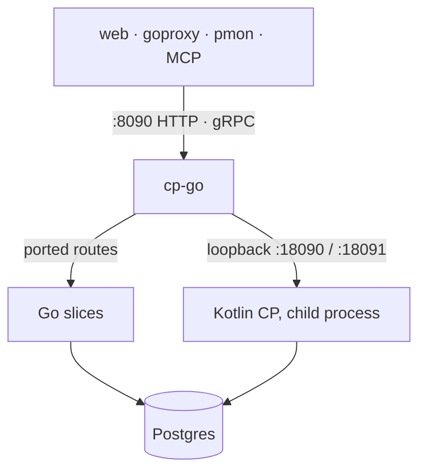

# Control plane to Go — migration plan

The control plane is the last Kotlin component. This plan moves it to Go one
slice at a time, behind a Go process that owns its ports from the first step.

This file is a summary. The original plan, with diagrams, phase status, and the
per-phase file lists, is the
[plan artifact](https://claude.ai/artifact/9V3VoaADjrYinG6TpJLVc7); viewing it
requires access granted by the maintainers.

Status: phases 0–2 done; phases 3–6 in progress (Go decides Cedar for the routes
it serves; roles, mask functions, policies, JIT access requests, users, groups,
datasources, tokens, web sessions, OIDC login, the IdP recheck, pmon's device
login and its daemon session run on Go); phases 7–8 not started.

## Shape

A Go front door, `cp-go`, takes over `:8090` and the gRPC port. It starts the
Kotlin control plane as a child process on loopback ports and forwards every
route it does not serve itself. Each phase then moves a whole slice (routes,
service, and store together) into Go and deletes the Kotlin code. Clients see no
change.

`cp-go` passes the same `PM_*` environment to the child with
`PM_HTTP_PORT=18090`, `PM_GRPC_PORT=18091`, and `PM_BIND_HOST=127.0.0.1`. The
bind host is new: without it Kotlin listens on every interface and can be
reached without going through `cp-go`. If the child exits, `cp-go` exits.

Both processes ship in the existing control-plane image, with `cp-go` as the
entrypoint, so deployment does not change. After the last phase the image is one
Go binary with no JRE and no native libraries.

## Phases

```mermaid
gantt
  dateFormat X
  axisFormat %s
  section Working days
  0 Front door          :0, 3
  1 Session gate        :3, 5
  2 Access-check bridge :5, 6
  3 Leaf slices         :6, 12
  4 Cedar and roles     :12, 18
  5 Admin CRUD          :18, 24
  6 Login and sessions  :24, 30
  7 Per-query path      :30, 39
  8 MCP, OAuth, cleanup :39, 43
```

| #   | Phase               | Moves                                                                     | Kotlin lines | Done when                                                       |
| --- | ------------------- | ------------------------------------------------------------------------- | ------------ | --------------------------------------------------------------- |
| 0   | Front door          | Port ownership, child process, forwarding                                 | 0            | e2e passes through `cp-go`; the JVM is unreachable from outside |
| 1   | Session gate        | Go reads console sessions; locale and query-history routes                | 50           | Go accepts exactly the sessions Kotlin does                     |
| 2   | Access-check bridge | Go routes ask Kotlin through one `Authorize` RPC                          | 0            | Every Go route calls a gate helper                              |
| 3   | Leaf slices         | Notifications, audit routes, connection info, SCIM                        | 2,930        | The audit chain verifies across the switch                      |
| 4   | Cedar and roles     | `cedar-go` replaces `cedar-java`, `RoleResolver` moves; bridge deleted    | 2,136        | No differences on a recorded request set                        |
| 5   | Admin CRUD          | Datasources, users, access, policies, approvals                           | 7,081        | Console admin and approvals run on Go                           |
| 6   | Login and sessions  | OIDC login, device login, wire tokens, `ValidateToken`, IdP recheck sweep | 2,907        | Web, pmon, and MCP login work end to end                        |
| 7   | Per-query path      | Catalog, `Decide`, `RunExec`, events, Athena                              | 6,643        | MySQL wire and editor masking match Kotlin                      |
| 8   | MCP, OAuth, cleanup | MCP server, OAuth, Flyway handover; delete the JVM build                  | 4,927        | The full gate passes with no JVM                                |

Login comes after admin CRUD because it provisions users and groups from the IdP
and gates on resolved roles; it moves once both are in Go.

Estimated at 31–46 working days in total.

## Cedar in Go

cp-go decides Cedar with cedar-go for the routes it serves. Kotlin keeps its own
engine for the query path until phase 7, so a policy change made by Go is still
signalled to it; a change Kotlin makes reaches Go through a fingerprint of the
enabled policies checked on each decision. Policy validation uses cedar-go's
experimental validator, whose error wording differs from Kotlin's.

`PM_CP_CEDAR=shadow` makes Kotlin decide while Go decides alongside and logs
every disagreement. `cpgo/cmd/cedar-diff` asks both engines every principal,
action, resource and requester IP a store holds and prints each disagreement.

## Risks

- In-memory state split across two processes. The events hub, the task
  completion hub, SSE streams, and the Cedar policy cache assume one process.
  Use Postgres `LISTEN/NOTIFY` while both run, and move each hub with every
  writer to it.
- `cedar-go` and `cedar-java` can disagree. Diff both on recorded requests
  before switching.
- The audit hash chain breaks if Go's canonical form differs by one byte from
  `AuditCanonical.kt`. Test both on the same rows first.
- Kotlin's Flyway owns migrations until phase 8; a Go runner then takes over the
  same files and history table.
- Go handlers return the same `ApiError(code, params)` and use the same gate
  helpers, built in phase 0.
